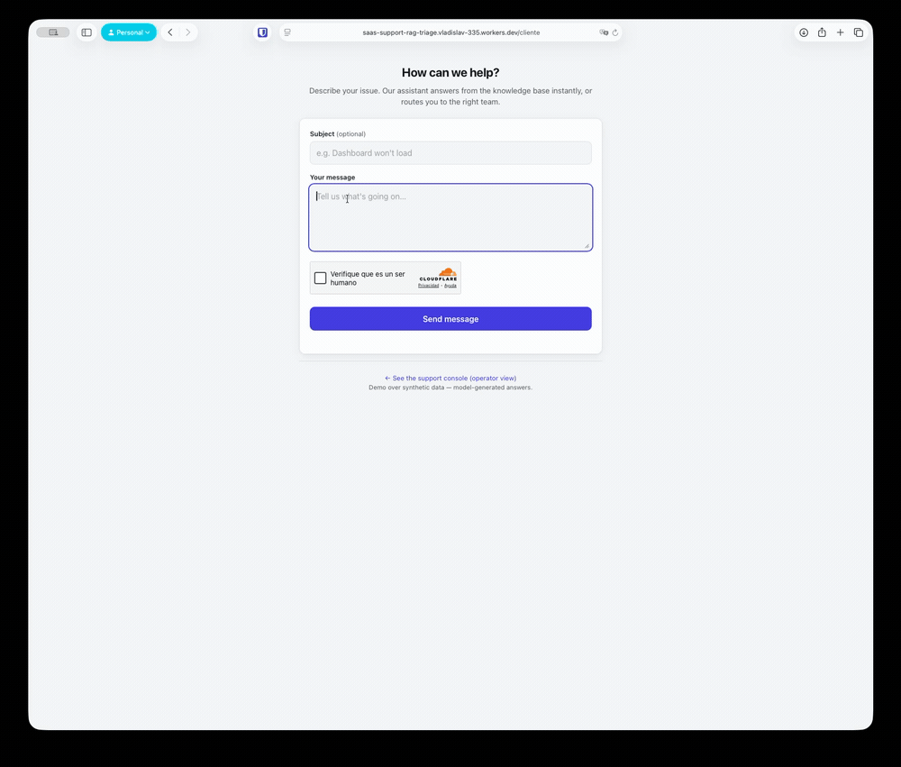
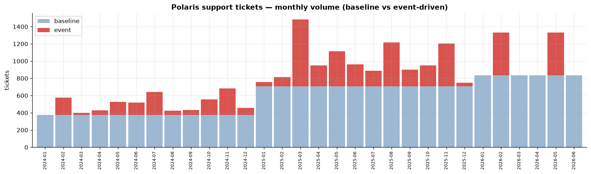

# Polaris — Support Triage & RAG

An end-to-end **support-ticket triage + retrieval-augmented answering** system,
built on a **synthetic dataset I designed and generated myself** for a fictional
analytics SaaS ("Polaris"). It classifies incoming tickets across five dimensions,
answers the deflectable ones from a knowledge base with **honest refusal when the
answer isn't there**, and routes the rest.

## ▶️ Live demo

A customer submits a ticket and gets a **live, grounded answer** — retrieved from the
knowledge base, streamed token-by-token, with the triage classification shown alongside.

*A real request against the deployed system: the answer is generated by **Gemini on Vertex
AI**, grounded in retrieved KB articles (note the **Sources**), and the ticket is classified
across topic · type · priority · routing — all in one pass. The typing is **real Server-Sent
Events streaming**, not a canned animation.*

The same backend powers two surfaces: this **customer view** (`/cliente`) and an **operator
console** that reviews the triaged queue. Deployed on **Cloudflare Workers**; the answer path
authenticates to Vertex AI server-side via a service-account JWT signed in the Worker.

*The ~24k-ticket dataset carries a temporal event layer: sharp **outage** spikes and
gradual **launch** waves over 2.5 years — not white noise.*

## 📦 The dataset (open)

- **Hugging Face:** https://huggingface.co/datasets/VladislavMarinovich/polaris-support-tickets-v2
- **Kaggle:** https://www.kaggle.com/datasets/vladislavmarinovich1/polaris-support-tickets-v2

~24,000 synthetic tickets (Jan 2024 – Jun 2026), each with coherent ground-truth
labels for topic · type · priority · routing · sentiment, plus a *noisy* intake
category (wrong ~35% of the time — the headroom the classifier recovers). CC-BY-4.0.
No real users, no PII.

## What's inside

| Piece | What it does |
|---|---|
| **Synthetic data pipeline** | scenario catalog → seeded sampler → LLM writer, with an additive **event layer** (`src/taxonomy.py`, `sampler.py`, `events.py`, `generate_event_layer.py`, `generate_dataset.py`) |
| **Triage classifier** | logistic regression on text embeddings, one model per label (`src/features.py`, `classify.py`) |
| **RAG** | chunk KB → embed → cosine over MongoDB → grounded answer or **honest refusal** (`src/chunk_kb.py`, `embed.py`, `vectorstore.py`, `rag.py`) |
| **Unified pipeline** | classify → gate on routing: `kb_autoresolve` → RAG answers; else → escalate (`src/triage.py`) |

## Highlights

- **Triage:** ~0.99 accuracy on the structural labels (topic/type/priority/routing);
  sentiment ~0.87. The intake picklist is right ~65% of the time — the model reads
  the text and recovers the true label.
- **Grounded RAG with honest refusal:** answers in-scope questions from the KB,
  refuses out-of-scope ones instead of hallucinating, and gives an honest *holding*
  answer for "when will you add connector X?" (a third behavior between answer and
  refusal).
- **A label-quality audit:** I found `security_incident` had conflated availability
  *outages* with real *breaches* — and the classifier had faithfully learned the
  mislabel. Corrected it and documented the lesson: *audit the labels, not just the
  metric* → [`notebooks/classifier_eval.ipynb`](notebooks/classifier_eval.ipynb).
- **Cost-aware:** the LLM is used where it adds value (grounded answers); templated
  responses where they suffice (escalation acks). Full spend tracked in
  [`docs/costs.md`](docs/costs.md) (~$3 of a $100 budget).

## 💸 Unit economics

Grounded answers run on Gemini 2.5 Flash-Lite over a cosine retrieval (no dedicated vector DB). Measured empirically on 2026-08-19 with a 30-query discovery corpus (mix of ES/EN, typos, and out-of-domain queries):

- **~US$0.000084 per grounded answer** (median measured cost — input ~700 tokens, output ~120 tokens)
- **≈ 11,100 answers per US$1** (~2× better than earlier estimate on older Gemini pricing)
- End-to-end latency **p50: 1.02 s · p95: 1.75 s** measured against Vertex AI in `us-central1` from the same discovery corpus.
- The whole project — dataset generation + embeddings + inference — has run on GCP for **~US$1.75 total**, fully covered by free-tier credits.

Cost stays low **by design**: only `kb_autoresolve` tickets hit the LLM; the rest get templated acknowledgments at **$0**. Full unit economics breakdown lives in `specs/001-polaris-v2/discovery/findings.md`.

## Notebooks

- **EDA** — the dataset's temporal signature, distributions and cross-tabs:
  [`notebooks/eda_v2.ipynb`](notebooks/eda_v2.ipynb) ·
  [español](notebooks/eda_v2_es.ipynb)
- **Classifier evaluation** — full metrics, a **learning curve** (how each label
  scales with data), and the label audit: [`notebooks/classifier_eval.ipynb`](notebooks/classifier_eval.ipynb)

## An honest note

This is a **method and pipeline demonstration**, not a claim of a perfect model.
The data is synthetic, so text maps to labels cleanly and scores run high; on real
tickets, expect lower. The design choices, caveats and label corrections are
documented rather than hidden — that transparency is the point.

## Stack

Python · scikit-learn · MongoDB (single store: tickets · KB · vectors) · Gemini on
Vertex AI (generation + `text-embedding-005`) · Anthropic Haiku · **Cloudflare Workers**
(live triage endpoint + SSE streaming) · pandas / matplotlib · `uv`.

> **Retrieval:** exact brute-force cosine over the 89 KB vectors in MongoDB — no
> dedicated vector DB. See [ADR 0001](docs/adr/0001-retrieval-without-a-dedicated-vector-db.md)
> for the right-sizing rationale and when a vector index *would* be warranted.

---

*Built by [Vlad Marinovich](https://github.com/VladislavMarinovich).*
