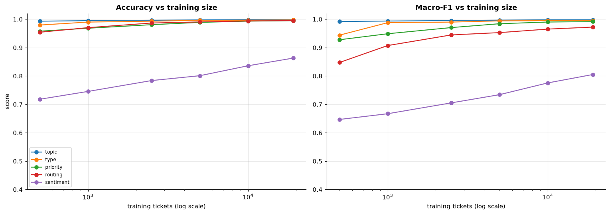

# Triage Classifier — Evaluation & Learning Curve (v2)

The classifier predicts five labels — **topic, type, priority, routing,
sentiment** — from a ticket's text, using the same 768-dim embeddings the RAG
uses for retrieval (one embedding infrastructure, two consumers).

The interesting question for a portfolio isn't just "what accuracy?" but **"how
does performance scale with data?"** We answer it with a **learning curve**: train
on growing subsets of the *same* v2 dataset and evaluate each on one **fixed**
held-out test set. This isolates the effect of *training size* — unlike comparing
the old 2k dataset to the new 24k one, which confounds *more data* with *a
different dataset*.

*Model: one-vs-rest logistic regression, `class_weight="balanced"`, per label.*


```python
import json
import numpy as np
import pandas as pd
import matplotlib.pyplot as plt
from sklearn.linear_model import LogisticRegression
from sklearn.model_selection import train_test_split
from sklearn.metrics import accuracy_score, f1_score

plt.rcParams.update({"figure.dpi": 110, "axes.grid": True, "grid.alpha": 0.3,
                     "axes.spines.top": False, "axes.spines.right": False})

# load the cached v2 embedding matrix + tickets directly (paths relative to
# notebooks/, so this runs correctly when the notebook's CWD is this folder)
X = np.load("../data/ticket_features_v2.npy")
tickets = [json.loads(l) for l in open("../data/tickets_v2.jsonl")]
assert X.shape[0] == len(tickets), "matrix / tickets length mismatch"
LABELS = ["topic", "type", "priority", "routing", "sentiment"]
print("feature matrix:", X.shape)
```

    feature matrix: (23994, 768)


## Full-data performance (trained on 80%, tested on the held-out 20%)


```python
idx = np.arange(len(X))
tr_idx, te_idx = train_test_split(idx, test_size=0.2, random_state=7)

def fit_eval(label, train_ids):
    y = np.array([t[label] for t in tickets])
    clf = LogisticRegression(max_iter=1000, class_weight="balanced")
    clf.fit(X[train_ids], y[train_ids])
    pred = clf.predict(X[te_idx])
    return (accuracy_score(y[te_idx], pred),
            f1_score(y[te_idx], pred, average="macro"))

full = {lab: fit_eval(lab, tr_idx) for lab in LABELS}
pd.DataFrame(full, index=["accuracy", "macro_F1"]).T.round(3)
```


<div>
<style scoped>
    .dataframe tbody tr th:only-of-type {
        vertical-align: middle;
    }

    .dataframe tbody tr th {
        vertical-align: top;
    }

    .dataframe thead th {
        text-align: right;
    }
</style>
<table border="1" class="dataframe">
  <thead>
    <tr style="text-align: right;">
      <th></th>
      <th>accuracy</th>
      <th>macro_F1</th>
    </tr>
  </thead>
  <tbody>
    <tr>
      <th>topic</th>
      <td>0.999</td>
      <td>0.998</td>
    </tr>
    <tr>
      <th>type</th>
      <td>0.998</td>
      <td>0.996</td>
    </tr>
    <tr>
      <th>priority</th>
      <td>0.995</td>
      <td>0.992</td>
    </tr>
    <tr>
      <th>routing</th>
      <td>0.995</td>
      <td>0.972</td>
    </tr>
    <tr>
      <th>sentiment</th>
      <td>0.863</td>
      <td>0.806</td>
    </tr>
  </tbody>
</table>
</div>


## Learning curve — accuracy & macro-F1 vs training size

Same fixed test set throughout; training subsets are nested random draws of
increasing size from the 80% train pool.


```python
rng = np.random.default_rng(7)
tr_shuf = rng.permutation(tr_idx)
sizes = [500, 1000, 2500, 5000, 10000, len(tr_idx)]

recs = []
for lab in LABELS:
    y = np.array([t[lab] for t in tickets])
    for n in sizes:
        sub = tr_shuf[:n]
        clf = LogisticRegression(max_iter=1000, class_weight="balanced")
        clf.fit(X[sub], y[sub])
        pred = clf.predict(X[te_idx])
        recs.append({"label": lab, "n_train": n,
                     "accuracy": accuracy_score(y[te_idx], pred),
                     "macro_F1": f1_score(y[te_idx], pred, average="macro")})
res = pd.DataFrame(recs)
print("done:", len(res), "fits")
```

    done: 30 fits


```python
fig, axes = plt.subplots(1, 2, figsize=(14, 5))
for lab in LABELS:
    d = res[res.label == lab]
    axes[0].plot(d.n_train, d.accuracy, marker="o", label=lab)
    axes[1].plot(d.n_train, d.macro_F1, marker="o", label=lab)
for ax, title in zip(axes, ["Accuracy vs training size", "Macro-F1 vs training size"]):
    ax.set_xscale("log"); ax.set_xlabel("training tickets (log scale)")
    ax.set_title(title, fontweight="bold"); ax.set_ylim(0.4, 1.02)
axes[0].set_ylabel("score"); axes[0].legend(fontsize=8)
plt.tight_layout(); plt.show()
```


    

    


**Read it:** `topic`, `type`, `routing` and `priority` saturate early — they
are near-perfect with only ~1–2k tickets, so extra data barely moves them
(diminishing returns; the embedding already separates these classes cleanly).
`sentiment` is the one that keeps climbing with more data — it is the softest,
most ambiguous label, so it is the one that actually *needs* the 24k. That is the
honest payoff of scaling this dataset: it helps precisely where the model was
weakest.

### The learning curve as a table (macro-F1)


```python
res.pivot(index="n_train", columns="label", values="macro_F1").round(3)
```


<div>
<style scoped>
    .dataframe tbody tr th:only-of-type {
        vertical-align: middle;
    }

    .dataframe tbody tr th {
        vertical-align: top;
    }

    .dataframe thead th {
        text-align: right;
    }
</style>
<table border="1" class="dataframe">
  <thead>
    <tr style="text-align: right;">
      <th>label</th>
      <th>priority</th>
      <th>routing</th>
      <th>sentiment</th>
      <th>topic</th>
      <th>type</th>
    </tr>
    <tr>
      <th>n_train</th>
      <th></th>
      <th></th>
      <th></th>
      <th></th>
      <th></th>
    </tr>
  </thead>
  <tbody>
    <tr>
      <th>500</th>
      <td>0.928</td>
      <td>0.848</td>
      <td>0.647</td>
      <td>0.992</td>
      <td>0.944</td>
    </tr>
    <tr>
      <th>1000</th>
      <td>0.949</td>
      <td>0.907</td>
      <td>0.667</td>
      <td>0.994</td>
      <td>0.988</td>
    </tr>
    <tr>
      <th>2500</th>
      <td>0.971</td>
      <td>0.945</td>
      <td>0.705</td>
      <td>0.995</td>
      <td>0.990</td>
    </tr>
    <tr>
      <th>5000</th>
      <td>0.984</td>
      <td>0.953</td>
      <td>0.734</td>
      <td>0.997</td>
      <td>0.994</td>
    </tr>
    <tr>
      <th>10000</th>
      <td>0.990</td>
      <td>0.965</td>
      <td>0.775</td>
      <td>0.998</td>
      <td>0.995</td>
    </tr>
    <tr>
      <th>19195</th>
      <td>0.992</td>
      <td>0.972</td>
      <td>0.805</td>
      <td>0.998</td>
      <td>0.996</td>
    </tr>
  </tbody>
</table>
</div>


## A label-quality audit — the `security_incident` fix

Reviewing the routing distribution surfaced a red flag: **841 tickets labelled
`security_incident`** — implausibly high for a well-run platform. On inspection,
**764 were dashboards outages** (an *availability* problem) and only **77 were
real security events** (cross-tenant leak, unauthorized access). The taxonomy had
conflated *availability* incidents with *security* incidents.

The subtle part: the classifier had faithfully **learned the mislabel** — its high
routing score was partly rewarding it for reproducing a flawed label (garbage in,
garbage out). **High accuracy against wrong labels is not a good model.**

Fix: re-route outages to `engineering` (on-call), reserving `security_incident`
for true breaches. After correction `security_incident` is a genuinely rare class
(~77) and routing macro-F1 dips slightly (0.99 → 0.98) — which is *more honest*:
the rare class is legitimately harder, and the metric now reflects real difficulty
instead of an inflated, easy majority.


```python
pd.Series([t["routing"] for t in tickets]).value_counts()
```


    kb_autoresolve       14089
    engineering           7645
    sales_success         1924
    retention              259
    security_incident       77
    Name: count, dtype: int64


**Lesson: audit the labels, not just the metric.** The fix cost no
regeneration — the ticket text never mentions the routing label, so correcting it
is a pure relabel.

## Honest caveats (for the dataset card / interview)

- These scores are **high because the data is synthetic**: the text carries a
  clean signal to its label by construction. On real support tickets, expect
  lower — this is a demonstration of the *pipeline and method*, not a claim that
  the model is infallible.
- The concrete value is **fixing noisy intake**: the customer's own category is
  wrong ~35% of the time; the model recovers the true topic from the text (~65%
  picklist accuracy → near-perfect model). That routing lift is the business case.
- `sentiment` is treated as an **operational prioritization signal**, so the
  metric that matters there is recall on action-triggering emotions (angry /
  anxious), not raw accuracy.
