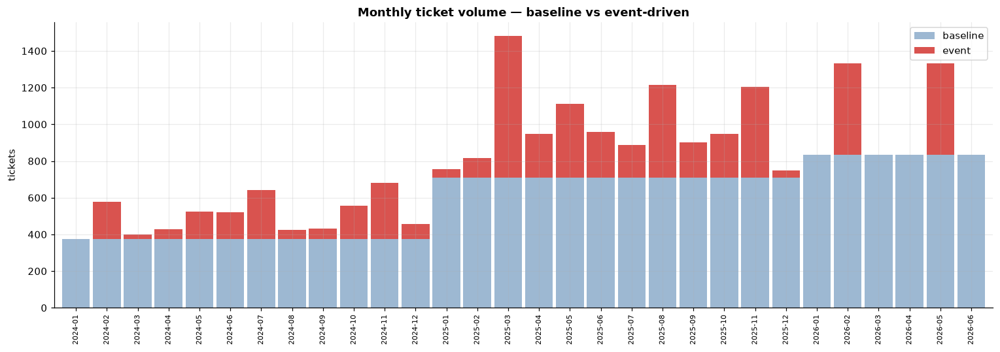
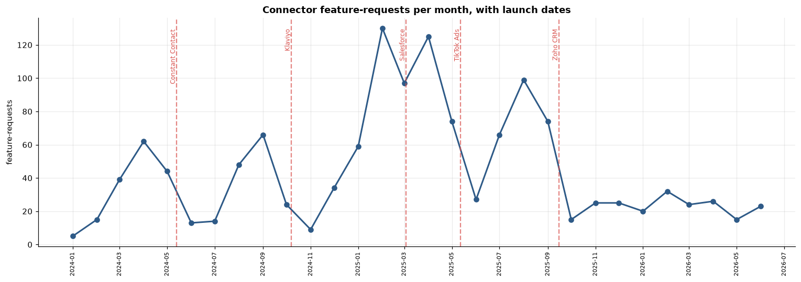
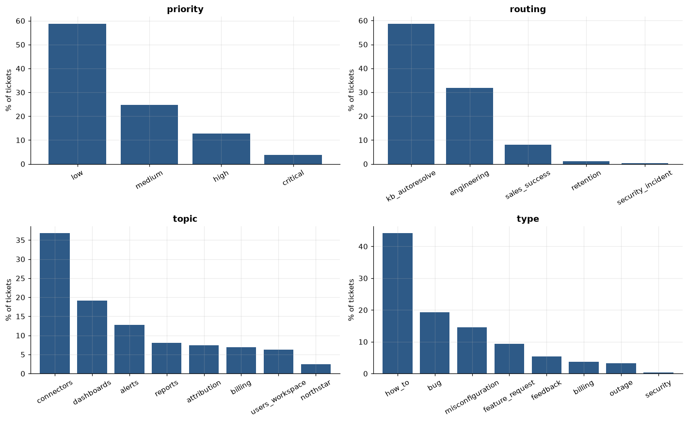
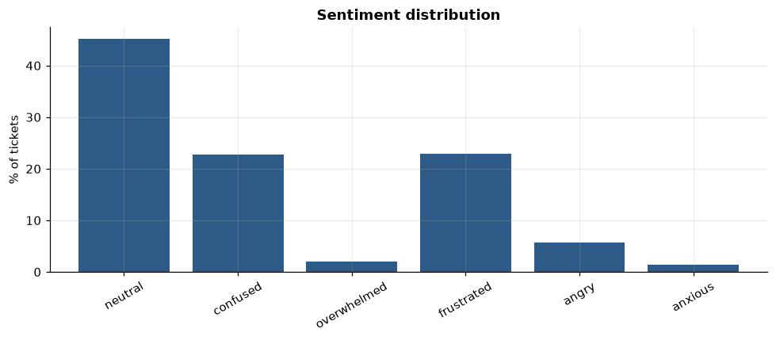
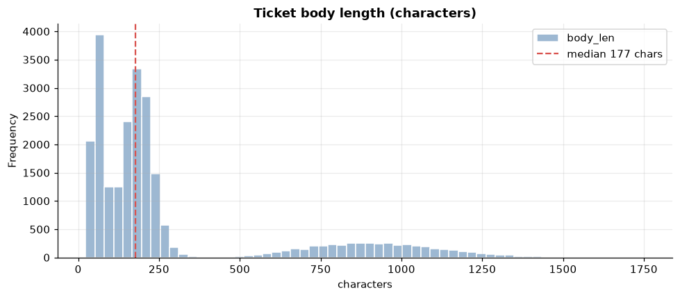

# Polaris Support Tickets — Synthetic Dataset v2 · EDA

**~24,000 synthetic support tickets** for *Polaris*, a fictional multichannel
analytics SaaS. Generated over a pipeline (scenario catalog → sampler → LLM),
with a **temporal event layer** on top: service **outages** (sharp spikes) and
feature **launches** (gradual waves), spread across **Jan 2024 → Jun 2026**.

This notebook verifies that the dataset has a realistic *temporal signature*
— not just balanced labels, but the clustering and seasonality real support
queues show — which is what makes it usable for triage, RAG-deflection **and**
time-series work (volume forecasting, anomaly detection).


```python
import json, sys
import pandas as pd
import matplotlib.pyplot as plt
import matplotlib.dates as mdates
sys.path.insert(0, "..")
from src.sampler import aligned_category  # the 'correct' picklist bucket per (topic, type)

pd.set_option("display.max_rows", 60)
plt.rcParams.update({"figure.dpi": 110, "axes.grid": True,
                     "grid.alpha": 0.25, "axes.spines.top": False,
                     "axes.spines.right": False, "font.size": 10})
ACCENT, BASE_C, EVT_C = "#2E5A87", "#9db8d2", "#d9534f"

rows = [json.loads(l) for l in open("../data/tickets_v2.jsonl")]
df = pd.DataFrame(rows)
df["created_at"] = pd.to_datetime(df["created_at"])
df["month"] = df["created_at"].dt.to_period("M").dt.to_timestamp()
df["is_event"] = df["event_id"].notna()
len(df), df["created_at"].min().date(), df["created_at"].max().date()
```


    (23994, datetime.date(2024, 1, 1), datetime.date(2026, 6, 30))


## Dataset at a glance


```python
n = len(df)
ev = df["is_event"].sum()
print(f"tickets          : {n:,}")
print(f"span             : {df.created_at.min().date()} -> {df.created_at.max().date()}")
print(f"event-driven     : {ev:,} ({ev/n*100:.1f}%)   baseline flow: {n-ev:,} ({(n-ev)/n*100:.1f}%)")
print(f"unique labels    : topic={df.topic.nunique()}  type={df.type.nunique()}  "
      f"priority={df.priority.nunique()}  routing={df.routing.nunique()}  sentiment={df.sentiment.nunique()}")
print("\nby year:")
print(df.groupby(df.created_at.dt.year).size().to_string())
```

    tickets          : 23,994
    span             : 2024-01-01 -> 2026-06-30
    event-driven     : 6,000 (25.0%)   baseline flow: 17,994 (75.0%)
    unique labels    : topic=8  type=8  priority=4  routing=5  sentiment=6
    
    by year:
    created_at
    2024     6017
    2025    11979
    2026     5998


### Event catalog

Every event in the layer, with its type, window and how many tickets it drove.


```python
cat = (df[df.is_event].groupby(["event_id", "event_type"])
       .agg(tickets=("ticket_id", "size"),
            first=("created_at", "min"), last=("created_at", "max"))
       .reset_index())
cat["first"] = cat["first"].dt.date
cat["last"] = cat["last"].dt.date
cat.sort_values("first").reset_index(drop=True)
```


<div>
<style scoped>
    .dataframe tbody tr th:only-of-type {
        vertical-align: middle;
    }

    .dataframe tbody tr th {
        vertical-align: top;
    }

    .dataframe thead th {
        text-align: right;
    }
</style>
<table border="1" class="dataframe">
  <thead>
    <tr style="text-align: right;">
      <th></th>
      <th>event_id</th>
      <th>event_type</th>
      <th>tickets</th>
      <th>first</th>
      <th>last</th>
    </tr>
  </thead>
  <tbody>
    <tr>
      <th>0</th>
      <td>launch_constant_contact_connector</td>
      <td>launch</td>
      <td>450</td>
      <td>2024-02-18</td>
      <td>2024-08-10</td>
    </tr>
    <tr>
      <th>1</th>
      <td>outage_ga4_sync_2024q1</td>
      <td>outage</td>
      <td>200</td>
      <td>2024-02-20</td>
      <td>2024-02-24</td>
    </tr>
    <tr>
      <th>2</th>
      <td>outage_dashboards_2024q3</td>
      <td>outage</td>
      <td>200</td>
      <td>2024-07-09</td>
      <td>2024-07-12</td>
    </tr>
    <tr>
      <th>3</th>
      <td>launch_klaviyo_connector</td>
      <td>launch</td>
      <td>450</td>
      <td>2024-07-25</td>
      <td>2025-01-05</td>
    </tr>
    <tr>
      <th>4</th>
      <td>outage_hubspot_sync_2024q4</td>
      <td>outage</td>
      <td>200</td>
      <td>2024-11-05</td>
      <td>2024-11-09</td>
    </tr>
    <tr>
      <th>5</th>
      <td>launch_salesforce_connector</td>
      <td>launch</td>
      <td>700</td>
      <td>2024-12-10</td>
      <td>2025-06-01</td>
    </tr>
    <tr>
      <th>6</th>
      <td>launch_tiktok_connector</td>
      <td>launch</td>
      <td>900</td>
      <td>2025-02-18</td>
      <td>2025-08-10</td>
    </tr>
    <tr>
      <th>7</th>
      <td>outage_dashboards_2025q1</td>
      <td>outage</td>
      <td>400</td>
      <td>2025-03-12</td>
      <td>2025-03-15</td>
    </tr>
    <tr>
      <th>8</th>
      <td>launch_zoho_connector</td>
      <td>launch</td>
      <td>700</td>
      <td>2025-06-21</td>
      <td>2025-12-14</td>
    </tr>
    <tr>
      <th>9</th>
      <td>outage_ga4_sync_2025q3</td>
      <td>outage</td>
      <td>400</td>
      <td>2025-08-19</td>
      <td>2025-08-23</td>
    </tr>
    <tr>
      <th>10</th>
      <td>outage_dashboards_2025q4</td>
      <td>outage</td>
      <td>400</td>
      <td>2025-11-04</td>
      <td>2025-11-07</td>
    </tr>
    <tr>
      <th>11</th>
      <td>outage_dashboards_2026q1</td>
      <td>outage</td>
      <td>500</td>
      <td>2026-02-17</td>
      <td>2026-02-20</td>
    </tr>
    <tr>
      <th>12</th>
      <td>outage_ga4_sync_2026q2</td>
      <td>outage</td>
      <td>500</td>
      <td>2026-05-06</td>
      <td>2026-05-10</td>
    </tr>
  </tbody>
</table>
</div>


### Per-year summary


```python
yr = (df.assign(year=df.created_at.dt.year).groupby("year")
      .agg(tickets=("ticket_id", "size"), event_driven=("is_event", "sum")))
yr["baseline"] = yr["tickets"] - yr["event_driven"]
yr["event_%"] = (yr["event_driven"] / yr["tickets"] * 100).round(1)
yr
```


<div>
<style scoped>
    .dataframe tbody tr th:only-of-type {
        vertical-align: middle;
    }

    .dataframe tbody tr th {
        vertical-align: top;
    }

    .dataframe thead th {
        text-align: right;
    }
</style>
<table border="1" class="dataframe">
  <thead>
    <tr style="text-align: right;">
      <th></th>
      <th>tickets</th>
      <th>event_driven</th>
      <th>baseline</th>
      <th>event_%</th>
    </tr>
    <tr>
      <th>year</th>
      <th></th>
      <th></th>
      <th></th>
      <th></th>
    </tr>
  </thead>
  <tbody>
    <tr>
      <th>2024</th>
      <td>6017</td>
      <td>1517</td>
      <td>4500</td>
      <td>25.2</td>
    </tr>
    <tr>
      <th>2025</th>
      <td>11979</td>
      <td>3483</td>
      <td>8496</td>
      <td>29.1</td>
    </tr>
    <tr>
      <th>2026</th>
      <td>5998</td>
      <td>1000</td>
      <td>4998</td>
      <td>16.7</td>
    </tr>
  </tbody>
</table>
</div>


### Metadata mix (channel · plan · role)


```python
meta = {}
for col in ["channel", "plan", "user_role"]:
    vc = df[col].value_counts()
    meta[col] = (vc / len(df) * 100).round(1)
pd.DataFrame(meta).rename_axis("value").fillna("")
```


<div>
<style scoped>
    .dataframe tbody tr th:only-of-type {
        vertical-align: middle;
    }

    .dataframe tbody tr th {
        vertical-align: top;
    }

    .dataframe thead th {
        text-align: right;
    }
</style>
<table border="1" class="dataframe">
  <thead>
    <tr style="text-align: right;">
      <th></th>
      <th>channel</th>
      <th>plan</th>
      <th>user_role</th>
    </tr>
    <tr>
      <th>value</th>
      <th></th>
      <th></th>
      <th></th>
    </tr>
  </thead>
  <tbody>
    <tr>
      <th>admin</th>
      <td></td>
      <td></td>
      <td>40.1</td>
    </tr>
    <tr>
      <th>analyst</th>
      <td></td>
      <td></td>
      <td>36.5</td>
    </tr>
    <tr>
      <th>chat</th>
      <td>35.0</td>
      <td></td>
      <td></td>
    </tr>
    <tr>
      <th>email</th>
      <td>49.9</td>
      <td></td>
      <td></td>
    </tr>
    <tr>
      <th>enterprise</th>
      <td></td>
      <td>15.0</td>
      <td></td>
    </tr>
    <tr>
      <th>growth</th>
      <td></td>
      <td>35.0</td>
      <td></td>
    </tr>
    <tr>
      <th>in_app</th>
      <td>15.1</td>
      <td></td>
      <td></td>
    </tr>
    <tr>
      <th>starter</th>
      <td></td>
      <td>50.0</td>
      <td></td>
    </tr>
    <tr>
      <th>viewer</th>
      <td></td>
      <td></td>
      <td>23.4</td>
    </tr>
  </tbody>
</table>
</div>


## 1. The temporal signature — the point of v2

Monthly volume, split into the steady **baseline flow** and the **event-driven**
tickets layered on top. A flat, memoryless generator would produce a boring
horizontal band; instead we see growth year-over-year, sharp **outage spikes**,
and broader **launch waves**.


```python
piv = (df.groupby(["month", "is_event"]).size()
         .unstack(fill_value=0).rename(columns={False: "baseline", True: "event"}))
# string month labels: a datetime index on a bar plot triggers a pandas Period/freq bug
piv.index = piv.index.strftime("%Y-%m")
ax = piv[["baseline", "event"]].plot(kind="bar", stacked=True, figsize=(14, 5),
                                     color=[BASE_C, EVT_C], width=0.9)
ax.set_title("Monthly ticket volume — baseline vs event-driven", fontweight="bold")
ax.set_xlabel(""); ax.set_ylabel("tickets")
ax.tick_params(axis="x", labelrotation=90); ax.tick_params(axis="x", labelsize=7)
ax.legend(title="")
plt.tight_layout(); plt.show()
```


    

    


**Read it:** the pale band (baseline) grows ~2x from 2024 to 2025 as the
company scales, then continues into 2026 H1. The red spikes are **outages**
(a connector or dashboards breaks → a burst of tickets in days). The wider red
build-ups are **launch waves** (a new connector ships → weeks of how-to
questions). This is exactly the clustering a real queue shows — and what a
forecasting or anomaly-detection model needs to learn from.

## 2. The launch arc — requests that vanish on launch day

Before a connector exists, customers ask *"when will you add X?"* (a
`feature_request`). The moment it ships, those requests stop and turn into
*"how do I connect X?"* (`how_to`). Plotting monthly **connector feature-requests**
with each launch date marked shows the requests building up and then dropping.


```python
fr = df[(df.type == "feature_request") & (df.topic == "connectors")]
monthly_fr = fr.groupby("month").size()
launches = {"Constant Contact": "2024-05-13", "Klaviyo": "2024-10-07",
            "Salesforce": "2025-03-03", "TikTok Ads": "2025-05-12",
            "Zoho CRM": "2025-09-15"}
fig, ax = plt.subplots(figsize=(14, 5))
ax.plot(monthly_fr.index, monthly_fr.values, marker="o", color=ACCENT, lw=2)
ax.set_title("Connector feature-requests per month, with launch dates",
             fontweight="bold")
ax.set_ylabel("feature-requests"); ax.set_xlabel("")
for name, d in launches.items():
    ts = pd.Timestamp(d)
    ax.axvline(ts, color=EVT_C, ls="--", alpha=0.7)
    ax.text(ts, ax.get_ylim()[1]*0.95, name, rotation=90, va="top",
            ha="right", fontsize=8, color=EVT_C)
ax.xaxis.set_major_locator(mdates.MonthLocator(interval=2))
ax.xaxis.set_major_formatter(mdates.DateFormatter("%Y-%m"))
plt.xticks(rotation=90, fontsize=7); plt.tight_layout(); plt.show()
```


    

    


**Read it:** each dashed line is a connector going live. Notice the request
volume climbs toward a launch and collapses right after it — the demand for a
connector is *answered* by shipping it. That pivot on a known date is a clean,
learnable temporal signal (and a nice story for the dataset card).

## 3. Label distributions — the ML targets


```python
fig, axes = plt.subplots(2, 2, figsize=(13, 8))
specs = [("priority", ["low", "medium", "high", "critical"]),
         ("routing", None), ("topic", None), ("type", None)]
for ax, (col, order) in zip(axes.ravel(), specs):
    vc = df[col].value_counts()
    if order:
        vc = vc.reindex(order)
    (vc / len(df) * 100).plot(kind="bar", ax=ax, color=ACCENT, width=0.8)
    ax.set_title(col, fontweight="bold"); ax.set_ylabel("% of tickets")
    ax.set_xlabel(""); ax.tick_params(axis="x", rotation=30)
plt.tight_layout(); plt.show()
```


    

    


**Read it:** **priority** follows a realistic long tail (most tickets are
routine, few are critical), skewed slightly toward high/critical by the outages.
**routing** is dominated by `kb_autoresolve` — the deflection opportunity the RAG
targets. **topic** and **type** stay spread across the product surface, so no
single class trivially dominates the classifier.

### Exact frequencies — the numbers behind the bars


```python
def freq_table(col, order=None):
    vc = df[col].value_counts()
    if order:
        vc = vc.reindex(order)
    return pd.DataFrame({"count": vc, "pct_%": (vc / len(df) * 100).round(1)})

pd.concat({c: freq_table(c) for c in ["topic", "type", "routing"]}, names=["field", "value"])
```


<div>
<style scoped>
    .dataframe tbody tr th:only-of-type {
        vertical-align: middle;
    }

    .dataframe tbody tr th {
        vertical-align: top;
    }

    .dataframe thead th {
        text-align: right;
    }
</style>
<table border="1" class="dataframe">
  <thead>
    <tr style="text-align: right;">
      <th></th>
      <th></th>
      <th>count</th>
      <th>pct_%</th>
    </tr>
    <tr>
      <th>field</th>
      <th>value</th>
      <th></th>
      <th></th>
    </tr>
  </thead>
  <tbody>
    <tr>
      <th rowspan="8" valign="top">topic</th>
      <th>connectors</th>
      <td>8827</td>
      <td>36.8</td>
    </tr>
    <tr>
      <th>dashboards</th>
      <td>4600</td>
      <td>19.2</td>
    </tr>
    <tr>
      <th>alerts</th>
      <td>3065</td>
      <td>12.8</td>
    </tr>
    <tr>
      <th>reports</th>
      <td>1940</td>
      <td>8.1</td>
    </tr>
    <tr>
      <th>attribution</th>
      <td>1777</td>
      <td>7.4</td>
    </tr>
    <tr>
      <th>billing</th>
      <td>1666</td>
      <td>6.9</td>
    </tr>
    <tr>
      <th>users_workspace</th>
      <td>1515</td>
      <td>6.3</td>
    </tr>
    <tr>
      <th>northstar</th>
      <td>604</td>
      <td>2.5</td>
    </tr>
    <tr>
      <th rowspan="8" valign="top">type</th>
      <th>how_to</th>
      <td>10591</td>
      <td>44.1</td>
    </tr>
    <tr>
      <th>bug</th>
      <td>4644</td>
      <td>19.4</td>
    </tr>
    <tr>
      <th>misconfiguration</th>
      <td>3498</td>
      <td>14.6</td>
    </tr>
    <tr>
      <th>feature_request</th>
      <td>2237</td>
      <td>9.3</td>
    </tr>
    <tr>
      <th>feedback</th>
      <td>1288</td>
      <td>5.4</td>
    </tr>
    <tr>
      <th>billing</th>
      <td>895</td>
      <td>3.7</td>
    </tr>
    <tr>
      <th>outage</th>
      <td>764</td>
      <td>3.2</td>
    </tr>
    <tr>
      <th>security</th>
      <td>77</td>
      <td>0.3</td>
    </tr>
    <tr>
      <th rowspan="5" valign="top">routing</th>
      <th>kb_autoresolve</th>
      <td>14089</td>
      <td>58.7</td>
    </tr>
    <tr>
      <th>engineering</th>
      <td>7645</td>
      <td>31.9</td>
    </tr>
    <tr>
      <th>sales_success</th>
      <td>1924</td>
      <td>8.0</td>
    </tr>
    <tr>
      <th>retention</th>
      <td>259</td>
      <td>1.1</td>
    </tr>
    <tr>
      <th>security_incident</th>
      <td>77</td>
      <td>0.3</td>
    </tr>
  </tbody>
</table>
</div>


```python
freq_table("priority", ["low", "medium", "high", "critical"])
```


<div>
<style scoped>
    .dataframe tbody tr th:only-of-type {
        vertical-align: middle;
    }

    .dataframe tbody tr th {
        vertical-align: top;
    }

    .dataframe thead th {
        text-align: right;
    }
</style>
<table border="1" class="dataframe">
  <thead>
    <tr style="text-align: right;">
      <th></th>
      <th>count</th>
      <th>pct_%</th>
    </tr>
    <tr>
      <th>priority</th>
      <th></th>
      <th></th>
    </tr>
  </thead>
  <tbody>
    <tr>
      <th>low</th>
      <td>14116</td>
      <td>58.8</td>
    </tr>
    <tr>
      <th>medium</th>
      <td>5935</td>
      <td>24.7</td>
    </tr>
    <tr>
      <th>high</th>
      <td>3051</td>
      <td>12.7</td>
    </tr>
    <tr>
      <th>critical</th>
      <td>892</td>
      <td>3.7</td>
    </tr>
  </tbody>
</table>
</div>


### Cross-tab: topic × type

Which ticket *types* appear in which product *areas* — counts, with margins.


```python
pd.crosstab(df.topic, df.type, margins=True, margins_name="Total")
```


<div>
<style scoped>
    .dataframe tbody tr th:only-of-type {
        vertical-align: middle;
    }

    .dataframe tbody tr th {
        vertical-align: top;
    }

    .dataframe thead th {
        text-align: right;
    }
</style>
<table border="1" class="dataframe">
  <thead>
    <tr style="text-align: right;">
      <th>type</th>
      <th>billing</th>
      <th>bug</th>
      <th>feature_request</th>
      <th>feedback</th>
      <th>how_to</th>
      <th>misconfiguration</th>
      <th>outage</th>
      <th>security</th>
      <th>Total</th>
    </tr>
    <tr>
      <th>topic</th>
      <th></th>
      <th></th>
      <th></th>
      <th></th>
      <th></th>
      <th></th>
      <th></th>
      <th></th>
      <th></th>
    </tr>
  </thead>
  <tbody>
    <tr>
      <th>alerts</th>
      <td>0</td>
      <td>571</td>
      <td>908</td>
      <td>0</td>
      <td>901</td>
      <td>685</td>
      <td>0</td>
      <td>0</td>
      <td>3065</td>
    </tr>
    <tr>
      <th>attribution</th>
      <td>0</td>
      <td>0</td>
      <td>0</td>
      <td>0</td>
      <td>859</td>
      <td>918</td>
      <td>0</td>
      <td>0</td>
      <td>1777</td>
    </tr>
    <tr>
      <th>billing</th>
      <td>895</td>
      <td>0</td>
      <td>0</td>
      <td>0</td>
      <td>771</td>
      <td>0</td>
      <td>0</td>
      <td>0</td>
      <td>1666</td>
    </tr>
    <tr>
      <th>connectors</th>
      <td>0</td>
      <td>2031</td>
      <td>1329</td>
      <td>0</td>
      <td>4614</td>
      <td>853</td>
      <td>0</td>
      <td>0</td>
      <td>8827</td>
    </tr>
    <tr>
      <th>dashboards</th>
      <td>0</td>
      <td>1468</td>
      <td>0</td>
      <td>1288</td>
      <td>1080</td>
      <td>0</td>
      <td>764</td>
      <td>0</td>
      <td>4600</td>
    </tr>
    <tr>
      <th>northstar</th>
      <td>0</td>
      <td>51</td>
      <td>0</td>
      <td>0</td>
      <td>553</td>
      <td>0</td>
      <td>0</td>
      <td>0</td>
      <td>604</td>
    </tr>
    <tr>
      <th>reports</th>
      <td>0</td>
      <td>523</td>
      <td>0</td>
      <td>0</td>
      <td>890</td>
      <td>527</td>
      <td>0</td>
      <td>0</td>
      <td>1940</td>
    </tr>
    <tr>
      <th>users_workspace</th>
      <td>0</td>
      <td>0</td>
      <td>0</td>
      <td>0</td>
      <td>923</td>
      <td>515</td>
      <td>0</td>
      <td>77</td>
      <td>1515</td>
    </tr>
    <tr>
      <th>Total</th>
      <td>895</td>
      <td>4644</td>
      <td>2237</td>
      <td>1288</td>
      <td>10591</td>
      <td>3498</td>
      <td>764</td>
      <td>77</td>
      <td>23994</td>
    </tr>
  </tbody>
</table>
</div>


### Cross-tab: routing × priority


```python
ct = pd.crosstab(df.routing, df.priority, margins=True, margins_name="Total")
ct[["low", "medium", "high", "critical", "Total"]]
```


<div>
<style scoped>
    .dataframe tbody tr th:only-of-type {
        vertical-align: middle;
    }

    .dataframe tbody tr th {
        vertical-align: top;
    }

    .dataframe thead th {
        text-align: right;
    }
</style>
<table border="1" class="dataframe">
  <thead>
    <tr style="text-align: right;">
      <th>priority</th>
      <th>low</th>
      <th>medium</th>
      <th>high</th>
      <th>critical</th>
      <th>Total</th>
    </tr>
    <tr>
      <th>routing</th>
      <th></th>
      <th></th>
      <th></th>
      <th></th>
      <th></th>
    </tr>
  </thead>
  <tbody>
    <tr>
      <th>engineering</th>
      <td>2237</td>
      <td>2437</td>
      <td>2156</td>
      <td>815</td>
      <td>7645</td>
    </tr>
    <tr>
      <th>kb_autoresolve</th>
      <td>10591</td>
      <td>3498</td>
      <td>0</td>
      <td>0</td>
      <td>14089</td>
    </tr>
    <tr>
      <th>retention</th>
      <td>0</td>
      <td>0</td>
      <td>259</td>
      <td>0</td>
      <td>259</td>
    </tr>
    <tr>
      <th>sales_success</th>
      <td>1288</td>
      <td>0</td>
      <td>636</td>
      <td>0</td>
      <td>1924</td>
    </tr>
    <tr>
      <th>security_incident</th>
      <td>0</td>
      <td>0</td>
      <td>0</td>
      <td>77</td>
      <td>77</td>
    </tr>
    <tr>
      <th>Total</th>
      <td>14116</td>
      <td>5935</td>
      <td>3051</td>
      <td>892</td>
      <td>23994</td>
    </tr>
  </tbody>
</table>
</div>


## 4. Sentiment — an operational prioritization signal


```python
order = ["neutral", "confused", "overwhelmed", "frustrated", "angry", "anxious"]
vc = (df["sentiment"].value_counts().reindex(order) / len(df) * 100)
ax = vc.plot(kind="bar", figsize=(9, 4), color=ACCENT, width=0.8)
ax.set_title("Sentiment distribution", fontweight="bold")
ax.set_ylabel("% of tickets"); ax.set_xlabel(""); ax.tick_params(axis="x", rotation=30)
plt.tight_layout(); plt.show()
```


    

    


**Read it:** sentiment is treated as an **operational** signal, not a claim
about feelings — it feeds *prioritization* (reach the angry / anxious customer
faster) and tone adaptation, so the metric that matters is recall on the
action-triggering emotions, not raw accuracy.

## 5. Intake noise — why the triage classifier earns its keep

`reported_category` is the customer's own dropdown choice at submit time — coarse
and often wrong. `aligned_category(topic, type)` is the bucket a correctly
self-tagging user *should* have picked. The gap between them is the headroom a
classifier recovers by reading the raw text.


```python
df["aligned"] = [aligned_category(t, ty) for t, ty in zip(df.topic, df.type)]
df["intake_ok"] = df.reported_category == df.aligned
print(f"overall intake mismatch: {(~df.intake_ok).mean()*100:.1f}% of tickets pick "
      f"a category that disagrees with the true labels")
```

    overall intake mismatch: 35.1% of tickets pick a category that disagrees with the true labels


Mismatch rate by true topic — where users mis-tag most:


```python
g = df.groupby("topic")["intake_ok"]
noise = pd.DataFrame({"n": g.size(), "mismatch_%": ((1 - g.mean()) * 100).round(1)})
noise.sort_values("mismatch_%", ascending=False)
```


<div>
<style scoped>
    .dataframe tbody tr th:only-of-type {
        vertical-align: middle;
    }

    .dataframe tbody tr th {
        vertical-align: top;
    }

    .dataframe thead th {
        text-align: right;
    }
</style>
<table border="1" class="dataframe">
  <thead>
    <tr style="text-align: right;">
      <th></th>
      <th>n</th>
      <th>mismatch_%</th>
    </tr>
    <tr>
      <th>topic</th>
      <th></th>
      <th></th>
    </tr>
  </thead>
  <tbody>
    <tr>
      <th>reports</th>
      <td>1940</td>
      <td>37.8</td>
    </tr>
    <tr>
      <th>attribution</th>
      <td>1777</td>
      <td>36.8</td>
    </tr>
    <tr>
      <th>billing</th>
      <td>1666</td>
      <td>35.8</td>
    </tr>
    <tr>
      <th>dashboards</th>
      <td>4600</td>
      <td>35.6</td>
    </tr>
    <tr>
      <th>connectors</th>
      <td>8827</td>
      <td>34.5</td>
    </tr>
    <tr>
      <th>users_workspace</th>
      <td>1515</td>
      <td>34.1</td>
    </tr>
    <tr>
      <th>alerts</th>
      <td>3065</td>
      <td>33.9</td>
    </tr>
    <tr>
      <th>northstar</th>
      <td>604</td>
      <td>32.8</td>
    </tr>
  </tbody>
</table>
</div>


**Read it:** roughly a third of tickets arrive mis-categorized by the user.
A model that reads the *text* and predicts the true topic/type converts that noisy
intake into a reliable routing signal — the concrete business value, not accuracy
for its own sake.

## 6. Event impact on severity

Priority mix **inside event windows** vs the **baseline** flow — this makes the
event layer's effect explicit.


```python
sev = pd.DataFrame({
    "baseline_%": (df[~df.is_event].priority.value_counts(normalize=True) * 100).round(1),
    "event_%": (df[df.is_event].priority.value_counts(normalize=True) * 100).round(1),
}).reindex(["low", "medium", "high", "critical"])
sev
```


<div>
<style scoped>
    .dataframe tbody tr th:only-of-type {
        vertical-align: middle;
    }

    .dataframe tbody tr th {
        vertical-align: top;
    }

    .dataframe thead th {
        text-align: right;
    }
</style>
<table border="1" class="dataframe">
  <thead>
    <tr style="text-align: right;">
      <th></th>
      <th>baseline_%</th>
      <th>event_%</th>
    </tr>
    <tr>
      <th>priority</th>
      <th></th>
      <th></th>
    </tr>
  </thead>
  <tbody>
    <tr>
      <th>low</th>
      <td>60.7</td>
      <td>53.3</td>
    </tr>
    <tr>
      <th>medium</th>
      <td>29.5</td>
      <td>10.4</td>
    </tr>
    <tr>
      <th>high</th>
      <td>8.9</td>
      <td>24.1</td>
    </tr>
    <tr>
      <th>critical</th>
      <td>0.9</td>
      <td>12.1</td>
    </tr>
  </tbody>
</table>
</div>


**Read it:** event-driven tickets skew markedly toward high/critical vs the
calm baseline — the severity spike a real incident produces, and the signal an
anomaly detector keys on.

## 7. Message length


```python
df["body_len"] = df["body"].fillna("").str.len()
ax = df["body_len"].plot(kind="hist", bins=60, figsize=(9, 4), color=BASE_C,
                         edgecolor="white")
ax.axvline(df.body_len.median(), color=EVT_C, ls="--",
           label=f"median {int(df.body_len.median())} chars")
ax.set_title("Ticket body length (characters)", fontweight="bold")
ax.set_xlabel("characters"); ax.legend()
plt.tight_layout(); plt.show()
```


    

    


**Read it:** a right-skewed spread — many terse chat messages, a long tail
of detailed emails — mirroring the length profile measured on real public
support datasets during calibration.

## What this dataset enables

- **Triage classification** — predict topic / type / priority / routing /
  sentiment from the raw text (coherent ground-truth labels by construction).
- **RAG deflection** — the `kb_autoresolve` mass is where a grounded,
  honest-refusal RAG assistant earns its keep.
- **Time-series** — the outage spikes and launch waves make volume
  **forecasting** and **anomaly detection** learnable, which a flat synthetic
  set cannot support.

*Synthetic data, generated on a real pipeline. No real users, no PII.*
